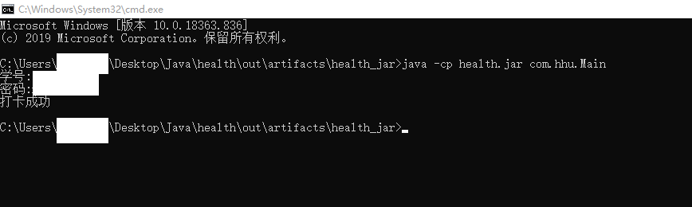

# HHUHealth
## 自动打卡机

### 项目背景

可每大学健康打卡系统

### 项目功能

自动打卡

### 两种选项

+ 扩展：在原有代码基础上扩展，实现定时任务，每天自动打卡，解放双手

+ Release：下载relase版，运行.jar包，输入用户名和密码，自动打卡

  + 命令

    ```bash
    java -cp health.jar com.hhu.Main
    ```

  + 案例

    

+ 结果验证

  在自动打卡后，可以通过官网查看历史打卡记录来进行验证

+ 说明

  + **没有进行详细的异常处理，所以请务必保证用户名和密码正确**
  
  + **打卡速度有待优化~，要等2~3s**
  
  + **可能还有bug…..**
  
  
  
  
  
  